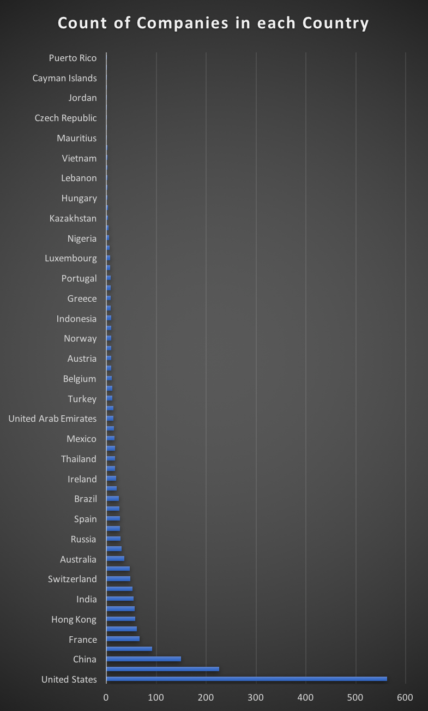
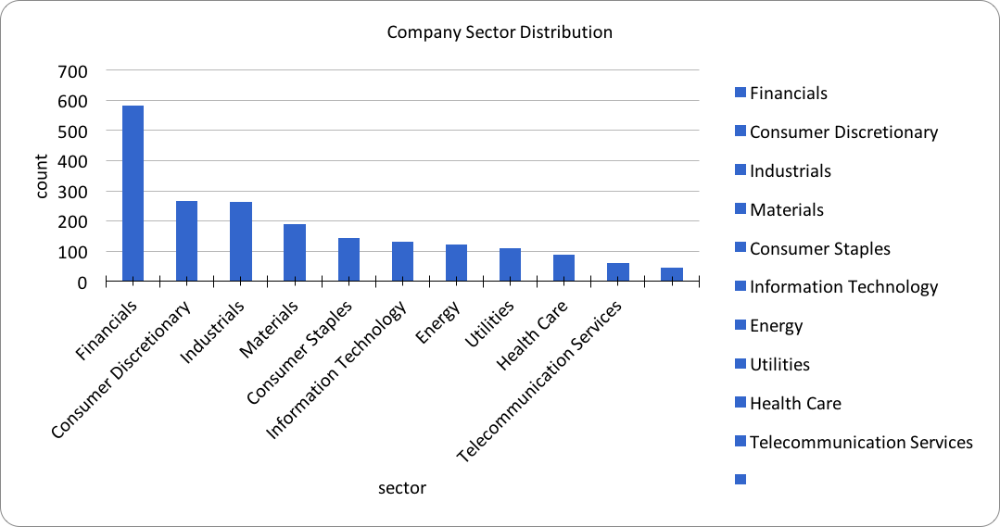
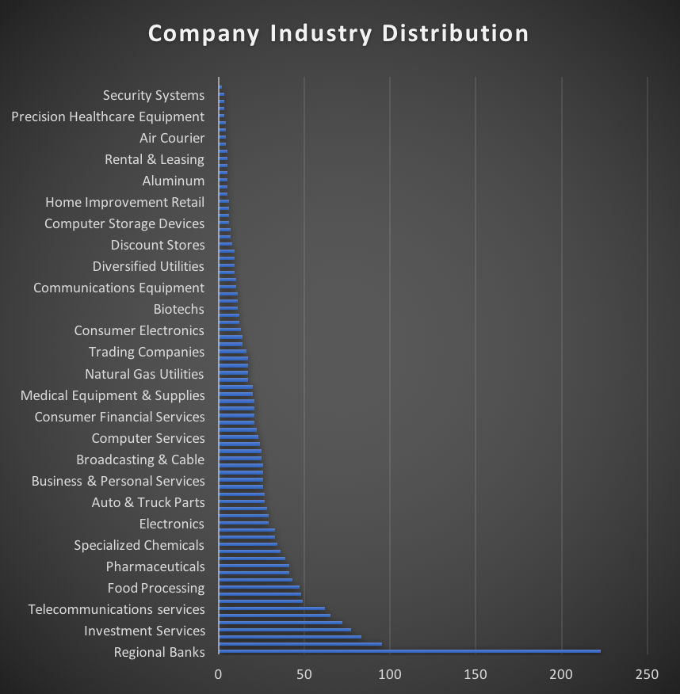
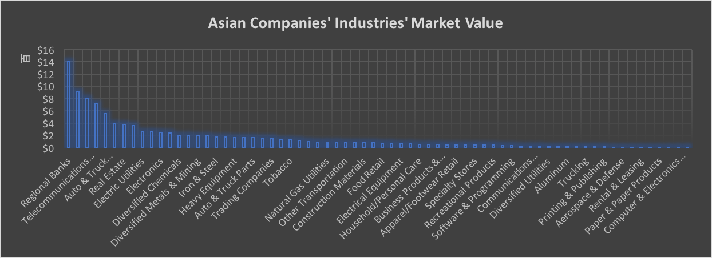
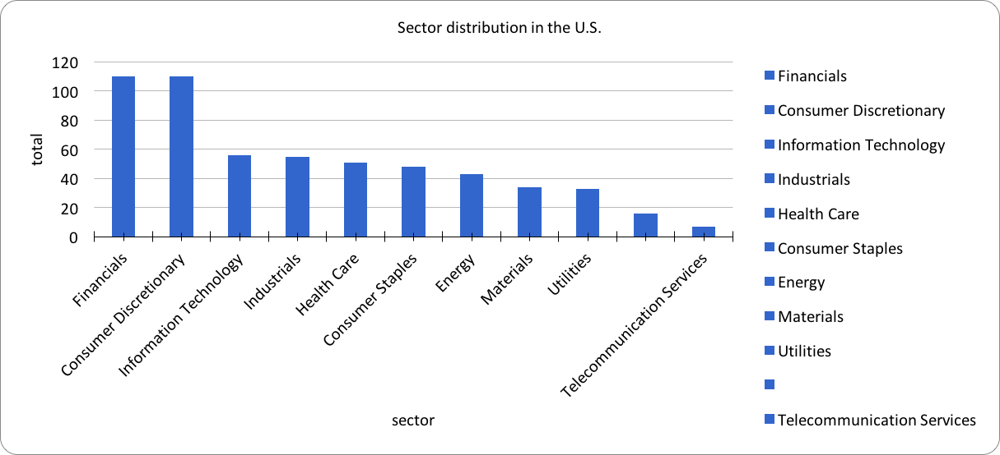
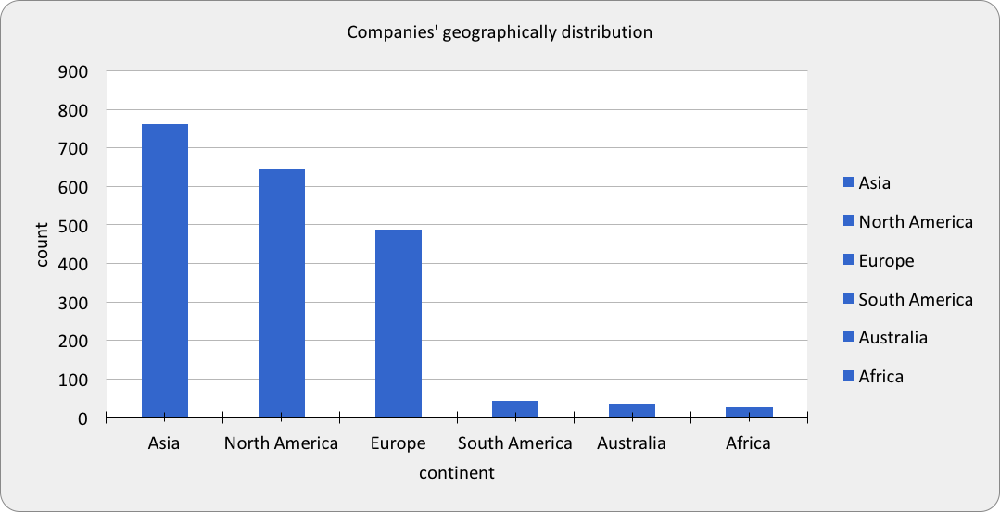

# Checkpoint3
Database: forbes_global_2010_2014


## Question 1
--Which country has the most companies from the dataset?

```sql
SELECT 
country,
count(company)
FROM datasets.forbes_global_2010_2014
group by country
order by count (company) DESC 
```


## Question 2
--Which is the most popular sector from the list?

```sql
SELECT sector,
count(*) 
FROM datasets.forbes_global_2010_2014
group by sector
order by count DESC
```


## Question 3
--What industries does most companies in?

```sql
SELECT 
industry,
count(company)
FROM datasets.forbes_global_2010_2014
group by industry
order by count (company) DESC 
```


## Question 4
--What is the average profit of major banking industry?

```sql
SELECT avg(profits)
FROM datasets.forbes_global_2010_2014
where industry = 'Major Banks' 

```
Answer: 4.5754

## Question 5
--Which industry has the highest market value in Asia?

```sql
SELECT 
industry,
sum(marketvalue) as total_marketvalue
FROM datasets.forbes_global_2010_2014 
where continent = 'Asia'
Group by industry
Order by total_marketvalue DESC
```


## Question 6
--What is the total market value of financial sector?

```sql
SELECT 
sum(marketvalue) as total_marketvalue
FROM datasets.forbes_global_2010_2014 
```
Answer: 44410.3

## Question 7
-- How many American companies on the list in 2014?

For this question, we look for the total number of american companies. We used COUNT function for the number of companies and limited the range by using where country= 'United States' and year='2014'.

```sql
SELECT
count(company)
from datasets.forbes_globa_2010_2014
where country= 'United States' and year='2014'
```


## Question 8
--What are the top 3 sectors in the United States?

For this question, we just want to know what sectors in the U.S. made most profits. We select all the sectors in the U.S. and order it by rank ASC. And then we got our most profitbale sectors.

```sql
SELECT 
sector
FROM datasets.forbes_global_2010_2014
where country= 'United States'
order by rank ASC
```


## Question 9
--What is the total assets of the energy sector?

For this question, we are looking for the total assets in the energy sector. We have the number of assets for every sector in the database, so we just sum up the asset column under the energy sector. And we got the answer of 6564.7.

```sql
SELECT 
sum(assets)
FROM datasets.forbes_global_2010_2014
where sector= 'Energy'
```
Answer: 6564.7

## Question 10
--Which continent has most companies?

For this question,we want to find out which continent has most companies listed on the forbes global. The database provides all the company names and continent. We select the column "Continent" and the count the number of companies. Then use order by DESC which will rank the highest number first.

```sql
SELECT 
continent,
count(company)
FROM datasets.forbes_global_2010_2014
group by continent
order by count (company) DESC
```



